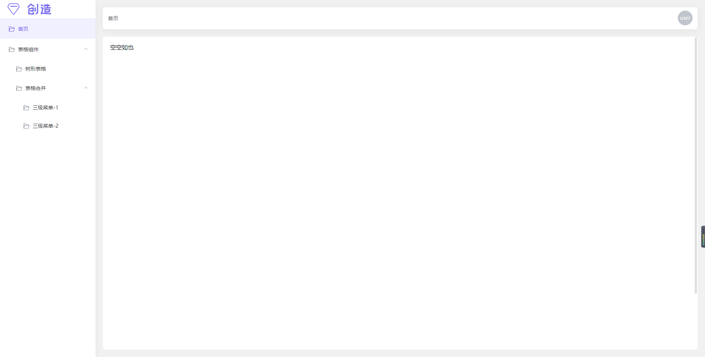
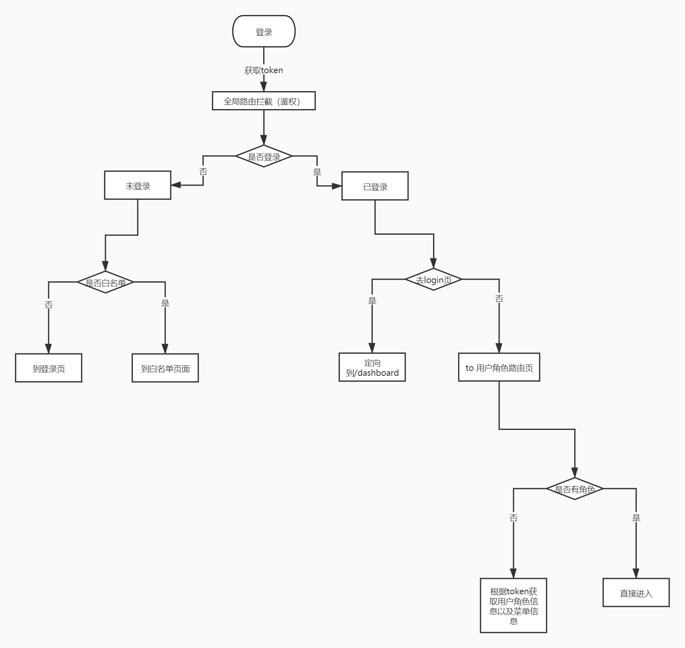

# vue3-element-plus-admin
## 查看项目

[点击前往](http://wangfan.store/docs)  目前是在git pages上面放置，如果慢的话后期会放到ecs上面去

[点击前往](http://wangfan.store)  这个是Vue3 组件库的项目，后期准备进行扩展。

## 项目截图

### 登录


### 首页



> 说明，因为是出于学习的目的，项目里面只实现了一个pc 端admin 的基本框架，基于Vue cli 的Vue3 的一个项目。里面没有写一些业务的实现，小伙伴可以基于现在实现的思路进行改造和扩展，比如，有的admin是顶部菜单+侧边菜单。遇到具体业务具体对待，解决问题的思路是互通的，本项目重点实现的项会在下面一一列举出来，有感兴趣的小伙伴，可以克隆本项目到本地研究研究^_^。

## 克隆项目

```bash
git clone https://github.com/xiuxiuyifan/vue3-element-plus-admin.git
```

## 安装依赖

```
yarn install
```

## 编译&启动
```
yarn serve
```

## 编译&打包
```
yarn build
```

## Lints and fixes files
```
yarn lint
```

## 参考文档
See [Configuration Reference](https://cli.vuejs.org/config/).

## 项目说明

本项目采用Vue3 + TypeScript + Vue-router4 +Vuex4 为核心，借助开源UI框架element plus的风格搭建的一个后台管理平台，有一下几个特点。

1. 动态路由（只需要和后台约定json就可以实现菜单权限控制）
2. 可定制型强（没有引入一些偏业务性的代码）
3. 只兼容PC端页面（少了一些冗余的代码）
4. 没有单元测试、没有Mock

### 约定

| 说明                    | 举例     |
| ----------------------- | -------- |
| 项目公共组件命名z为前缀 | z-icon   |
| 页面下的子组件以v为前缀 | v-header |
| 组件命名开头必须大写    | VHeader  |
| 文件夹用下划线命名      | side-bar |

## 实现思路还原



### 鉴权

当用户登录之后，拥有了`token` 和`role`之后再全局的路由钩子里面再获取相应的菜单信息，菜单信息里面包括可以访问的`router`  模拟获取到的`menu`信息如下

```javascript
import NProgress from 'nprogress'
import router from './router/index'
import {getToken} from "@/utils/utils";
import 'nprogress/nprogress.css'


import store from './store/index'

const whiteList = ['/login']

router.beforeEach(async (to, from, next) => {
  NProgress.start()
  if (getToken()) {
    if (to.path === '/login') {
      next('/dashboard')
    } else {
      // @ts-ignore
      let hasRoles = store.state.permission.roles && store.state.permission.roles.length > 0
      if (hasRoles) {
        next()
      } else {
        // 获取用户信息
        let {roles,routes} = await store.dispatch('getUserInfo')
        //添加路由信息
        let accessRoutes = await store.dispatch('generateRouters', routes)
        accessRoutes.forEach((item: any) => {
          router.addRoute(item)
        })
        next({...to, replace: true})
      }
    }
  } else {
    if (whiteList.indexOf(to.path) != -1) {
      next()
    } else {
      //未登录的时候会重定向到登录页面
      next(`/login?redirect=${to.path}`)
    }
  }
})

router.afterEach(()=>{
  NProgress.done()
})
```

### 菜单数据

```javascript
//只有一个的时候渲染一级菜单，
//当有孩子的时候渲染二级菜单
// route 1 可以添加 route 2  route 2 可以添加 route 3
// 一级菜单1   子菜单2   菜单详情3
const menu = [
  {
    "redirect": null,
    "path": "/dashboard",
    "component": "dashboard/index",
    "route": "1",
    "id": '0',
    "pid": null,
    "meta": {
      "keepAlive": true,
      "internalOrExternal": false,
      "icon": "home",
      "componentName": "Analysis",
      "title": "首页"
    },
    "name": "dashboard-analysis",
  },
  {
    "redirect": null,
    "path": "/table",
    "component": "/table",
    "route": "1",
    "id": '1',
    "pid": null,
    "meta": {
      "keepAlive": true,
      "internalOrExternal": false,
      "icon": "table",
      "componentName": "table",
      "title": "表格组件"
    },
    "name": "table",
    children: [
      {
        "redirect": null,
        "path": "/table/tree-table",
        "component": "table/tree-table/index",
        "route": "2",
        "pid": '1',
        "id": '2',
        "meta": {
          "keepAlive": true,
          "internalOrExternal": false,
          "icon": "home",
          "componentName": "tree-table",
          "title": "树形表格"
        },
        "name": "tree-table",
      },
      {
        "redirect": null,
        "path": "/table/merge-table",
        "component": "table/merge-table/index",
        "route": "2",
        "pid": '1',
        "id": '3',
        "meta": {
          "keepAlive": true,
          "internalOrExternal": false,
          "icon": "home",
          "componentName": "merge-table",
          "title": "表格合并"
        },
        "name": "merge-table",
        children: [
          {
            path: "/table/merge-table/detail1",
            component: "table/merge-table/detail1/index",
            "pid": '3',
            "id": '4',
            meta: {
              title: "三级菜单-1",
            }
          },
          {
            path: "/table/merge-table/detail2",
            component: "table/merge-table/detail2/index",
            "pid": '3',
            "id": '5',
            meta: {
              title: "三级菜单-2",
            }
          }
        ],
        //详情页面
        details: [
          {
            path: '/table/merge-table/details',
            route: '3'
          }
        ]
      }
    ]
  }
]

export {
  menu
}
```


### 渲染菜单

根据每次获取得到的`menu`信息采用递归组件渲染出菜单信息，并结合`Vue-router`实现页面的切换

```javascript
<!--对应layout components side-bar 下面的组件-->
<el-menu
      :default-active="defaultActive"
      router
      class="el-menu-vertical-demo z-menu"
      style="width: 260px"
  >
    <v-sidebar-item v-for="(item,index) in menu" :key="index" :menu="item"></v-sidebar-item>
  </el-menu>
```

### 动态添加路由

根据`menu`将树形数据进行展开，再调用`Vue-router`提供的动态添加`router`的方法实现，菜单权限的控制，动态生成前端路由表。

```javascript
let accessRoutes = await store.dispatch('generateRouters', routes)
accessRoutes.forEach((item: any) => {
  router.addRoute(item)
})
```


